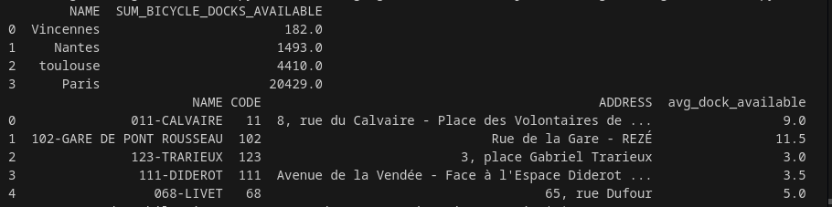

# Projet Data Engineering : Pipeline de données des stations de vélos

Ce projet traite des données en temps réel des stations de vélos à Paris, Nantes et Toulouse. Il consolide, transforme et agrège ces données pour une utilisation analytique. Le workflow comprend l'ingestion de données JSON, leur consolidation dans un format structuré, et leur agrégation pour un reporting final.

## Objectifs principaux

- Récupérer les données des stations de vélos à Nantes et Toulouse via des APIs.
- Normaliser les données des deux villes pour garantir une structure uniforme.
- Analyser les données consolidées pour obtenir des insights exploitables.
- Assurer la maintenabilité et l’évolutivité du pipeline.

## Explication du code existant

Le projet est découpé en 3 parties :

1. Un fichier python pour récupérer et stocker les données dans des fichiers localement

2. Un fichier python pour consolider les données et faire un premier load dans une base de données type data-warehouse

3. Un fichier python pour agréger les données et créer une modélisation de type dimensionnelle

### Ingestion des données

Ces fonctions sont des points clés de la phase d'ingestion des données dans le projet. Elles récupèrent les données en temps réel via des API publiques pour alimenter le pipeline d'analyse.

### code existant de Paris

```python
def get_paris_realtime_bicycle_data():
    url = "https://opendata.paris.fr/api/explore/v2.1/catalog/datasets/velib-disponibilite-en-temps-reel/exports/json"
    response = requests.request("GET", url)
    serialize_data(response.text, "paris_realtime_bicycle_data.json")

def serialize_data(raw_json: str, file_name: str):
    today_date = datetime.now().strftime("%Y-%m-%d")
    if not os.path.exists(f"data/raw_data/{today_date}"):
        os.makedirs(f"data/raw_data/{today_date}")
    with open(f"data/raw_data/{today_date}/{file_name}", "w") as fd:
        fd.write(raw_json)
```

Ces fonctions python sont assez simples. Elles récupèrent les données sur une API open-source, et les stockent dans un fichier json localement. Ces fonctions sont dans le fichier python `data_ingestion.py`.

### code ajouté de Nantes et Toulouse

```python

def get_nantes_realtime_bicycle_data():
    url = "https://data.nantesmetropole.fr/api/explore/v2.1/catalog/datasets/244400404_stations-velos-libre-service-nantes-metropole-disponibilites/exports/json"
    response = requests.request("GET", url)
    if response.status_code == 200:
        serialize_data(response.text, "nantes_realtime_bicycle_data.json")
    else:
        print(f"Failed to fetch data for Nantes. Status code: {response.status_code}")

def get_toulouse_realtime_bicycle_data():
    url = "https://data.toulouse-metropole.fr/api/explore/v2.1/catalog/datasets/api-velo-toulouse-temps-reel/exports/json"
    response = requests.request("GET", url)
    if response.status_code == 200:
        serialize_data(response.text, "toulouse_realtime_bicycle_data.json")
    else:
        print(f"Failed to fetch data for Toulouse. Status code: {response.status_code}")

def get_communes_realtime_data():
    url = "https://geo.api.gouv.fr/communes"
    response = requests.get(url)
    if response.status_code == 200:
        json_data = json.dumps(response.json(), ensure_ascii=False, indent=4)
        serialize_data(json_data, "communes_realtime_data.json")
    else:
        print(f"Failed to fetch data for Communes. Status code: {response.status_code}")

```

- La fonction '**get_nantes_realtime_bicycle_data**' se concentre sur la récupération des données des stations de vélos en libre-service pour la métropole de Nantes, incluant des informations telles que l'état des stations, la disponibilité des vélos et leur capacité. De manière similaire, la fonction '**get_toulouse_realtime_bicycle_data**' permet d'obtenir des données actualisées sur les stations de vélos pour la métropole de Toulouse, fournissant des informations structurées pour un traitement ultérieur.

- la fonction '**get_communes_realtime_data**' enrichit le pipeline en récupérant des informations détaillées sur les communes françaises, comme leurs noms, codes postaux et populations, afin de compléter les données des villes pour les analyses. Ensemble, ces fonctions assurent la collecte de données à jour, sauvegardées localement sous forme de fichiers JSON pour être consolidées et analysées dans les étapes suivantes du pipeline.

### Création de la table consolidate_communes

```sql
CREATE TABLE IF NOT EXISTS CONSOLIDATE_COMMUNES(
    id VARCHAR NOT NULL,
    name VARCHAR ,
    department_code VARCHAR,
    region_code VARCHAR,
    postal_codes VARCHAR,
    population INTEGER,
    CREATED_DATE VARCHAR,
    PRIMARY KEY (id, CREATED_DATE)
);
```

La table '**CONSOLIDATE_COMMUNES**' a été créée pour centraliser les données des communes françaises issues de l'API des communes françaises, assurant ainsi une meilleure performance, indépendance et traçabilité. Elle permet d'éviter les appels répétés à l'API, réduisant les temps de traitement tout en offrant la flexibilité de croiser ces informations avec d'autres tables. 


### Consolidation des données

**Duckdb** est une base de données de type data-warehouse que l'on peut utiliser localement, car elle charge les données en "in-memory" ou dans un fichier local. C'est l'équivalent de SQLite, mais pour des bases de données de type data-warehouse. Créer une connexion duckdb permet de "créer" une database et d'interagir avec comme avec un vrai data-warehouse. C'est parfait pour des projets de ce type. Plus d'informations sur le site officiel de duckdb : https://duckdb.org/.

Dans le fichier `data_consolidation.py` on trouve une fonction qui permet de créer les tables dans une base de données **duckdb**. On utilise le fichier `create_consolidate_tables.sql` pour définir les schémas des tables. Vous ne devriez pas avoir à modifier les schémas des tables, mais vous pouvez le faire si vous voyez une optimisation ou si le schéma est contraignant pour vous pour la réalisation de ce TP.

```python
def create_consolidate_tables():
    con = duckdb.connect(database = "data/duckdb/mobility_analysis.duckdb", read_only = False)
    with open("data/sql_statements/create_consolidate_tables.sql") as fd:
        statements = fd.read()
    for statement in statements.split(";"):
        print(statement)
        con.execute(statement)
```

Une fois les tables créées, on peut lancer les autres fonctions de consolidation. Elles fonctionnent toutes de la même manière :

1. Consolidation des données de Nantes

- '**nantes_consolidate_city_data**' : Cette fonction prépare les données pour la ville de Nantes, en spécifiant un city_code fixe qu'on récupère après automatiquement à partir de la table consolidate_communes quand a créé et remplit à partir des données de l'API des communes françaises, le nom de la ville ("Nantes") et en ajoutant une colonne pour la date de création (created_date). Les données sont ensuite insérées dans la table CONSOLIDATE_CITY.

- '**consolidate_nantes_station_data**' : Cette fonction traite les données des stations de vélos de Nantes. Elle extrait les informations des données brutes JSON, ajoute un identifiant (id), un code pour la ville (city_code) et normalise les colonnes. Les données sont ensuite insérées dans la table CONSOLIDATE_STATION après transformation et standardisation.

- '**nantes_consolidate_station_statement_data**' : Cette fonction s'occupe des données de disponibilité des stations de Nantes. Elle extrait les informations sur le nombre de vélos et de bornes disponibles, ainsi que la date de mise à jour, et les insère dans la table CONSOLIDATE_STATION_STATEMENT.

2. Consolidation des données de Toulouse

- '**toulouse_consolidate_city_data**' : Similaire à Nantes, cette fonction initialise les données pour la ville de Toulouse avec un city_code fixe (mise à jour de cet attribut avec des données de la table consolidate_commune) et insère les informations de la ville dans CONSOLIDATE_CITY.

- '**consolidate_toulouse_station_data**' : Cette fonction traite les données des stations de vélos de Toulouse, en suivant les mêmes étapes que pour Nantes : extraction, normalisation et insertion dans la table CONSOLIDATE_STATION.

- '**toulouse_consolidate_station_statement_data**' : Cette fonction extrait les informations des stations de vélos en libre-service pour Toulouse, notamment la disponibilité des vélos et des bornes, puis les insère dans CONSOLIDATE_STATION_STATEMENT.


3. Consolidation des communes

- '**consolidate_communes_data**' : Cette fonction extrait les données des communes françaises à partir d'une API externe. Elle normalise les colonnes, ajoute une date de création (created_date) et les insère dans la table CONSOLIDATE_COMMUNES. Cette table est essentielle pour enrichir les informations sur les villes avec des données telles que le code postal et la population.

4. Mise à jour des tables consolidées

- '**update_consolidate_station**' : Cette fonction met à jour le champ CITY_CODE dans la table CONSOLIDATE_STATION en utilisant les données de la table CONSOLIDATE_COMMUNES, en comparant les noms de villes. Elle garantit que chaque station a un code ville valide basé sur les informations des communes.

- '**update_consolidate_city**' permet de mettre à jour le champ ID dans la table CONSOLIDATE_CITY en se basant sur les données disponibles dans la table CONSOLIDATE_COMMUNES. L'objectif est d'assurer que l'ID de chaque ville dans CONSOLIDATE_CITY corresponde au code postal (ou identifiant unique) de la ville, tel qu'il est défini dans CONSOLIDATE_COMMUNES. 


### Agrégation des données

Dans le fichier `data_agregation.py` on trouve une fonction qui permet de créer les tables dans une base de données **duckdb**. On utilise le fichier `create_agregate_tables.sql` pour définir les schémas des tables. Ces tables représentent une modélisation dimensionnelle simple :

- Deux tables de dimensions : `dim_city` et `dim_station` qui représentent les données descriptives des villes et des stations de vélos en libre-service.

- Une table de faits : `fact_station_statement` qui représente les relevés de disponibilité des vélos dans les stations.

- La fonction `agregate_dim_city` permet d'enrichir les données des villes en consolidant les informations issues des tables `CONSOLIDATE_CITY` et `CONSOLIDATE_COMMUNES`. En reliant les deux tables par leur ID, elle extrait le nombre d'habitants depuis la table des communes et l'intègre à la table `DIM_CITY`. 

- La fonction `aggregate_dim_commune` joue un rôle clé dans l'enrichissement des données géographiques consolidées. Elle insère ou met à jour la table `DIM_COMMUNE`(qu'on a créé) en sélectionnant les informations les plus récentes depuis la table `CONSOLIDATE_COMMUNES`. Cela garantit que les colonnes telles que l'identifiant, le nom, le code départemental, le code régional, les codes postaux, la population et la date de création reflètent les données les plus à jour. 


```python
def create_agregate_tables():
    con = duckdb.connect(database = "data/duckdb/mobility_analysis.duckdb", read_only = False)
    with open("data/sql_statements/create_agregate_tables.sql") as fd:
        statements = fd.read()
    for statement in statements.split(";"):
        print(statement)
        con.execute(statement)
```

Une fois les tables créées, on peut lancer les autres fonctions d'agrégation. Pour les tables de dimensions, les fonctions sont assez simples. Elles basculent les données des tables de consolidation dans leur table correspondante.

La fonction pour la table `fact_station_statement` est plus complexe. Car elle doit faire les jointures avec les autres tables pour que les données soient analysables avec les données descriptives des tables de dimensions. C'est pourquoi elle est remplie via cette requête SQL :

```sql
INSERT OR REPLACE INTO FACT_STATION_STATEMENT
SELECT STATION_ID, CITY_CODE, BICYCLE_DOCKS_AVAILABLE, BICYCLE_AVAILABLE, LAST_STATEMENT_DATE, current_date as CREATED_DATE
FROM CONSOLIDATE_STATION_STATEMENT
JOIN CONSOLIDATE_STATION ON CONSOLIDATE_STATION.ID = CONSOLIDATE_STATION_STATEMENT.STATION_ID
LEFT JOIN CONSOLIDATE_CITY as cc ON cc.ID = CONSOLIDATE_STATION.CITY_CODE
WHERE CONSOLIDATE_STATION_STATEMENT.CREATED_DATE = (SELECT MAX(CREATED_DATE) FROM CONSOLIDATE_STATION_STATEMENT)
AND CONSOLIDATE_STATION.CREATED_DATE = (SELECT MAX(CREATED_DATE) FROM CONSOLIDATE_STATION);
```

Cette requête SQL réalise une jointure entre la table `CONSOLIDATE_STATION` et la table `CONSOLIDATE_STATION_STATEMENT`. Ensuite, elle fait une jointure avec la table `CONSOLIDATE_CITY`, pour obtenir l'ID de la ville. Enfin, elle remplit la table `FACT_STATION_STATEMENT` avec les données récupérées. On ne récupère que les dernières données des tables de consolidation via les deux `CONSOLIDATE_STATION_STATEMENT.CREATED_DATE = (SELECT MAX(CREATED_DATE) FROM...)` car on a décidé d'historiser les données de nos tables de consolidation.

### Le fichier main.py

Le fichier `main.py` contient le code principal du processus et exécute séquentiellement les différentes fonctions expliquées plus haut. L'ordre des fonctions de consolidation et d'agrégation n'est pas important.


### Comment faire fonctionner ce projet?

Pour faire fonctionner ce sujet, c'est assez simple:

```bash 
git clone https://github.com/MohamedRachadi/Projet-Data-Engineering.git

cd polytech-de-101-2024-tp-subject

python3 -m venv .venv

source .venv/bin/activate

pip install -r requirements.txt

python src/main.py
```


Les résultats finaux après lancement des requetes:

```sql
-- Nb d'emplacements disponibles de vélos dans une ville
SELECT dm.NAME, tmp.SUM_BICYCLE_DOCKS_AVAILABLE
FROM DIM_CITY dm INNER JOIN (
    SELECT CITY_ID, SUM(BICYCLE_DOCKS_AVAILABLE) AS SUM_BICYCLE_DOCKS_AVAILABLE
    FROM FACT_STATION_STATEMENT
    WHERE CREATED_DATE = (SELECT MAX(CREATED_DATE) FROM CONSOLIDATE_STATION)
    GROUP BY CITY_ID
) tmp ON dm.ID = tmp.CITY_ID
WHERE lower(dm.NAME) in ('paris', 'nantes', 'vincennes', 'toulouse');

-- Nb de vélos disponibles en moyenne dans chaque station
SELECT ds.name, ds.code, ds.address, tmp.avg_dock_available
FROM DIM_STATION ds JOIN (
    SELECT station_id, AVG(BICYCLE_AVAILABLE) AS avg_dock_available
    FROM FACT_STATION_STATEMENT
    GROUP BY station_id
) AS tmp ON ds.id = tmp.station_id;
```
